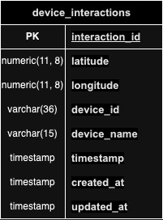

# Overview

## Project Structure

```
.
├── cmd                     # application commands
├── config                  # application configuration
├── intrastructure          # dealing with the infrastructure layer such as DB connection, AMQP server, etc.
├── internal                # core implementation goes here, whether core business, handlers, repositories.
│   ├── core
│   │   ├── domain          # business entities
│   │   ├── port            # abstraction layer, to separate the core business from handlers and repositories.
│   │   └── service         # application's core business.
│   │
│   ├── handler             # application's handler for the APIs.
│   └── repostiory          # repositories to dealing with the external soruces whether DB, external service, or just a simple CSV file.
|
│── mocks                   # mock interfaces for unit testing
├── pkg                     # utility packages.
├── protocol                # application's protocols to listerning on incoming traffics.
|── main.go                 # entry point to run the application
```

## High Level Design


## Data Model



# API Specification

## API: Device Submission
### Description
sending device's metrics to store on the server
### HTTP Request
```POST https://<Host>/v1/devices/interactions```
### Authorization
None
### Request Headers
```Content-Type: application/json```

### Request Body

| Parameter | Required | Data Type    | Example | Description                                                                              |
| --------- | -------- | ------------ | ------- | ---------------------------------------------------------------------------------------- |
| timestamp    | yes      | timestamp         |    "2006-01-02 15:04:05"    | timestamp metric to specify the time that devices interact with. see the list format that the system supported [Docs](https://pkg.go.dev/time#pkg-constants)            |
| location    | yes      | [location](#Location) |     -    | Geographical coordinates|
| devices    | yes      | List of [device](#device) |    -     | List of devices for submission. List the devices to submit. The list must have at least 1 element and not exceed 10 elements. |

#### example
```json
{
    "timestamp": "2006-01-02 15:04:05",
    "location": {
        "latitude": "-85.05115",
        "longitude": "100"
    },
    "devices": [
        {
            "id": "8489a92b-1284-4919-a1c2-3d5101a54978",
            "name": "ninja-luga-bapho"
        }
    ]
}
```
example cURL
```bash
curl --location 'http://localhost:8080/v1/devices/interactions' \
--header 'Content-Type: application/json' \
--data '{
    "timestamp": "2006-01-02 15:04:05",
    "location": {
        "latitude": "-85.05115",
        "longitude": "100"
    },
    "devices": [
        {
            "id": "8489a92b-1284-4919-a1c2-3d5101a54978",
            "name": "ninja-luga-bapho"
        }
    ]
}'
```

### Response
#### Success
```Status: 204 No Content```
#### Error
[Error Response](#error-response)
## Error Response
| Parameter | Explicit | Data Type    | Example | Description                                                                              |
| --------- | -------- | ------------ | ------- | ---------------------------------------------------------------------------------------- |
| code    | yes      | string      |   "XYZ-12345"  |    [Error code](#error-code)  |
| message    | yes      | string |   "bad request"    | [Error description](#error-code) |
errors    | no      | any |  -    | Error extension |


## Object
### Location
| Parameter | Required | Data Type    | Example | Description                                                                              |
| --------- | -------- | ------------ | ------- | ---------------------------------------------------------------------------------------- |
| latitude    | yes      | numeric      |    -85.05115 or "-85.05115"  |     Must be in the range -85.05115 to 85 and the maximum decimal number must not exceed 8 digits       |
| longitude    | yes      | numeric |   100 or "100"     | Must be in the range of -85.05115 and 85 |
### Device
| Parameter | Required | Data Type    | Example | Description                                                                              |
| --------- | -------- | ------------ | ------- | ---------------------------------------------------------------------------------------- |
| id    | yes      | string      |    "8489a92b-1284-4919-a1c2-3d5101a54978"  |  Must be in the form of UUID and must not exceed 36 characters      |
| name    | yes      | string |   100 or "100"     | Must satisfy this Regular Expression `^[a-zA-Z0-9]+-[a-zA-Z0-9]+-[a-zA-Z0-9]+$` and must not exceed 15 characters |


## Success Code
| Code | Description |
| --------- | -------- |
| DVI-20001    | success      |
## Error Code
| Code | HTTP Status | Description |
| --------- | -------- | -------- |
| DVI-40001    | 400 | bad request      |
| DVI-50001    | 500 | internal server error      |
DVI-50003    | 503 | server unavailable      |

## BigQuery
**_NOTE_**: This query doesn't work because some of columns have been used in group and aggregate expression on the same column
```query
-- start from --
DECLARE start_at TIMESTAMP DEFAULT TIMESTAMP_SUB(CURRENT_TIMESTAMP(), INTERVAL 1480 DAY);
-- to --
DECLARE end_at TIMESTAMP DEFAULT CURRENT_TIMESTAMP();
-- timeframe resolution (seconds) --
DECLARE timeframe INT64 DEFAULT 900;
-- threshold for detection --
DECLARE deviation_threshold FLOAT64 DEFAULT 2.0;


-- find stadard deviation in specific timeframe --
WITH DeviceInteractionStats AS (
  SELECT
    miner,
    TIMESTAMP_SECONDS(UNIX_SECONDS(`timestamp`) - MOD(UNIX_SECONDS(`timestamp`), timeframe)) AS interaction_time_series,
    COUNT(*) AS interaction_count,
    STDDEV_POP(COUNT(*)) OVER (PARTITION BY miner, TIMESTAMP_SECONDS(UNIX_SECONDS(`timestamp`) - MOD(UNIX_SECONDS(`timestamp`), timeframe))) AS base_stddev
  FROM
    `bigquery-public-data.ethereum_blockchain.blocks`
  WHERE
    `timestamp` BETWEEN start_at AND end_at
  GROUP BY
    miner, interaction_time_series
)

SELECT
  interaction_time_series,
  miner,
  interaction_count,
  base_stddev,
  ABS(interaction_count - AVG(interaction_count) OVER (PARTITION BY miner, interaction_time_series)) / base_stddev AS anomaly_score
FROM (
  SELECT
    device_id,
    interaction_time_series,
    interaction_count,
    base_stddev
  FROM
    DeviceInteractionStats
)
HAVING
  anomaly_score > deviation_threshold
ORDER BY
  anomaly_score DESC;
```

---


# How to run on locally?

## Prerequisite
- `make` command
- `docker`
- `go` version 1.21+

## Get started
- create `.env` file in the root project, copy the value from `.env.example`, then edit those values which suitable for your local configuration
- `make docker.up` (you can skip this step if you already have PostgreSQL on your localhost)
- `make start` to run the application


## Known Issues
- Docker on workflows still doesn't work, got permission problem to use some actions from market place into my organization
- Cloud Run deployment status = to-do

## Additional Information
- It took me a while to solve the problem with GitHub private repository access via SSH
- It took me a couple of hours to set Subnet networking to allow the Cloud Run application to access the SQL server privately
- I've initiated some terraform and linked the state file to the back end (storage), but haven't done any landing zone, or other provisioning by the way
