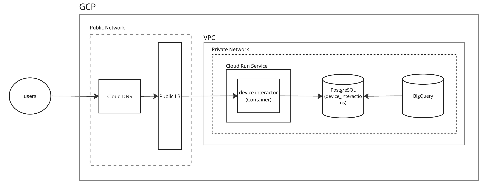

# Overview

## Project Structure

```
.
├── cmd                     # application commands
├── config                  # application configuration
├── intrastructure          # dealing with the infrastructure layer such as DB connection, AMQP server, etc.
├── internal                # core implementation goes here, whether core business, handlers, repositories.
│   ├── core
│   │   ├── domain          # business entities
│   │   ├── port            # abstraction layer, to separate the core business from handlers and repositories.
│   │   └── service         # application's core business.
│   │
│   ├── handler             # application's handler for the APIs.
│   └── repostiory          # repositories to dealing with the external soruces whether DB, external service, or just a simple CSV file.
|
│── mocks                   # mock interfaces for unit testing
├── pkg                     # utility packages.
├── protocol                # application's protocols to listerning on incoming traffics.
|── main.go                 # entry point to run the application
```

## High Level Design


## Data Model
draft...


# API Specification

## API: Device Submission
### Description
sending device's metrics to store on the server
### HTTP Request
```POST https://<Host>/v1/devices/interactions```
### Authorization
None
### Request Headers
```Content-Type: application/json```

### Request Body
example request body
```json
{
    "timestamp": "2006-01-02 15:04:05",
    "location": {
        "latitude": "-85.05115",
        "longitude": "100"
    },
    "devices": [
        {
            "id": "8489a92b-1284-4919-a1c2-3d5101a54978",
            "name": "ninja-luga-bapho"
        }
    ]
}
```
| Parameter | Required | Data Type    | Example | Description                                                                              |
| --------- | -------- | ------------ | ------- | ---------------------------------------------------------------------------------------- |
| timestamp    | yes      | timestamp         |    "2006-01-02 15:04:05"    | timestamp metric to specify the time that devices interact with. see the list format that the system supported [Docs](https://pkg.go.dev/time#pkg-constants)            |
| location    | yes      | [location](#Location) |     -    | Geographical coordinates|
| devices    | yes      | List of [device](#device) |    -     | List of devices for submission |


## Object
### Location
| Parameter | Required | Data Type    | Example | Description                                                                              |
| --------- | -------- | ------------ | ------- | ---------------------------------------------------------------------------------------- |
| latitude    | yes      | numeric      |    -85.05115 or "-85.05115"  |     Must be in the range -85.05115 to 85 and the maximum decimal number must not exceed 8 digits       |
| longitude    | yes      | numeric |   100 or "100"     | Must be in the range of -85.05115 and 85 |
### Device
| Parameter | Required | Data Type    | Example | Description                                                                              |
| --------- | -------- | ------------ | ------- | ---------------------------------------------------------------------------------------- |
| id    | yes      | string      |    "8489a92b-1284-4919-a1c2-3d5101a54978"  |  Must be in the form of UUID and must not exceed 36 characters      |
| name    | yes      | string |   100 or "100"     | Must satisfy this Regular Expression `^[a-zA-Z0-9]+-[a-zA-Z0-9]+-[a-zA-Z0-9]+$` and must not exceed 15 characters |


# How to run on locally?

## Prerequisite
- `make` command
- `docker`
- `go` version 1.21+

## Get started
- create `.env` file in the root project, copy the value from `.env.example`, then edit those values which suitable for your local configuration
- `make docker.up` (you can skip this step if you already have PostgreSQL on your localhost)
- `make start` to run the application
